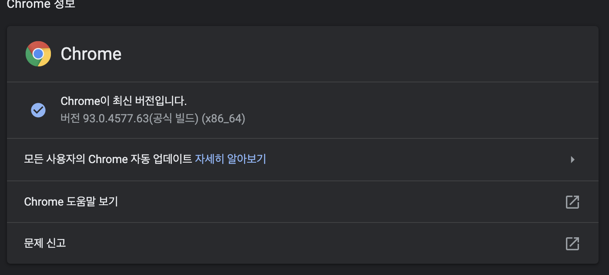
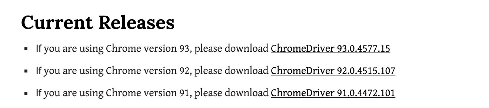
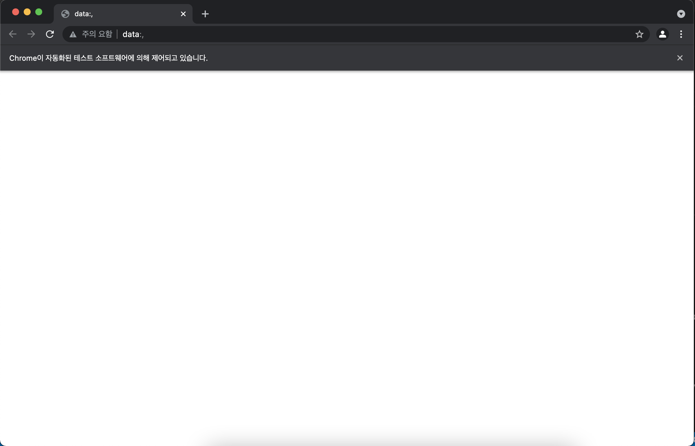
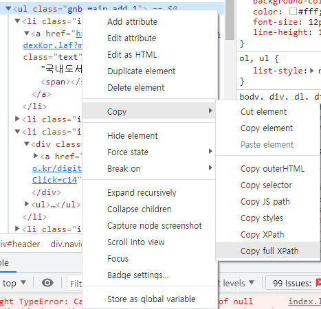

# 셀레니움 활용하기


## install


### 라이브러리 설치

```shell
$ pip install selenium
```


### 브라우저 드라이버 설치

> 셀레니움을 실행하기 위해서는 브라우저 드라이버가 필요하다.
>
> 크롬, 파이어폭스, 마이크로소프트 엣지 등이 있다.
>
> 해당 프로젝트는 mac 과 크롬으로 사용하고 있다.


1. 크롬버전 확인하기

   1. 
      - 크롬 우측 상단 `...` - 도움말 - 크롬정보

2. 크롬 드라이버 파일 다운로드 받기

   - 해당하는 OS 와 크롬 버전에 맞게 드라이버를 다운로드 받는다.
   - 어디에 해도 상관은 없는 것 같지만 경로가 다르면 여러가지 귀찮은 것들이 생길 수 있으니
     파이썬 파일과 같은 디렉토리에 넣는 것을 추천한다.
   - 
     - 일단 버전이 완전히 일치하는 것은 없지만 영어를 읽어봐서는 93 류를 사용하라는 것 같다.
   - OS 에 맞는 zip 을 다운받아서 chromedriver 이라는 파일을 얻는다.

3. 크롬 드라이버 파일 위치

   - 우리가 실행할 `.py` 파일과 동일한 디렉토리에 놓아준다.

     - 경로를 모른다면?

       ```python
       import os
       print(os.getcwd())
       ```

   - ```shell
     $ls
     chromedriver    hi_selenium.py  venv
     ```


## Hi! Selenium


1. Test

   - ```python
     import selenium
     from selenium import webdriver
     from selenium.webdriver.common.keys import Keys
     
     driver = webdriver.Chrome("/Users/new_2/Desktop/ssafy/crawling/hicrawl/src/chromedriver")
     # driver = webdriver.Chrome("./chromedriver")
     ```

     - `driver = webdriver.Chrome()` 이 부분에서 경로를 찾을 수 없다고 해서 당황했다.
       이것은 상대경로로 가지 않고, 절대경로로 간다고 한다.
       크롬드라이버의 절대경로를 넣어주면 된다.
       **아니다 상대경로도 먹는다!!!!!!!!!!!**

   - 결과

     - 
       - 빈 창이 나오면 성공이다.


## Import

```python
# 여러 개의 동작을 체인으로 묶어서 저장하고 실행할 수 있도록 하는 것
# 마우스 이동, 클릭, 키보드누르기, 드래그앤 드롭 가능
from selenium.webdriver import ActionChains

# keys : 키보드에 키를 제공하는 것 같다.
from selenium.webdriver.common.keys import Keys
# By : 요소를 찾는 데 사용하는 속성
from selenium.webdriver.common.by import By

# expected_conditions : 예상조건지원 이라고 한다.
from selenium.webdriver.support import expected_conditions as EC
# select 요소를 처리하는데 도움을 주는 것 같다. 일일이 선택하지 않아도 되도록 하는 것 같음
from selenium.webdriver.support.ui import Select
# WebDriverWait : 대기지원, 요소가 나타나 때까지 대기를 하는 것
from selenium.webdriver.support.ui import WebDriverWait
```


## URL 로 가기


- `driver.get(url=URL)`

  - 해당하는 url 로 간다

  - ```python
    URL = "http://www.kyobobook.co.kr/index.laf"
    
    driver = webdriverChrome("./chromedriver")
    driver.get(url=URL)
    ```

- `driver.current_url`

  - 현재 페이지 url 을 얻을 수 있다.

- `driver.close()`

  - 웹 드라이버 닫기

- `driver.quit()`

  - 웹 드라이버 종료


## 대기하기

> 브라우저에서 모든 element 를 바로 로드하지는 못한다.
>
> 따라서 element 가 없다는 에러를 방지하기 위해서는 기다려주는 것이 필요하다.


- 암묵적 대기

  - `driver.implicity_wait(time_to_wait=n)`

    - 찾으려는 element 가 로드될 때까지 지정한 시간만큼 대기할 수 있도록 설정한다.

    - 인자는 초 단위

    - Default=0

    - ```python
      # 5초 동안 element가 로드될 때 까지 기다려준다는 의미
      driver.implicitly_wait(time_to_wait=5)
      driver.quit()
      ```

- 명시적 대기

  - 그냥 강제적으로 몇 초를 기다리게 하는 것도 있지만, 좋지않다.

  - ```python
    # 명시적 대기
    try:
      element = WebDriverWait(driver, 5).until(
        EC.presence_of_element_located((By.CLASS_NAME, 'box_welcome_personal'))
      )
    finally:
      driver.quit()
    ```

    - `box_welcome_personal` 이라는 classname을 지닌 것을 기다리는 것이다.
    - 0.5초에 한번 씩 검사하는 것을 5초간 진행할 것이다. 만약에 찾을 수 있다면 True 를 반환하고, 찾을 수 없다면 False 반환


## 엘레멘트 찾기

> 여러가지 방법이 있다는 점!

- `find_element_by_종류()`

  - 이것은 하나만 나오는 것이다.
    아마 html 문서에서 가장 먼저 나오는 것이 출력될 것이다.

  - ```python
    driver.find_element_by_xpath('html/body/div[2]/div[1]') # Xpath 로 접근하기
    driver.find_element_by_class_name('gnb_main') # 클래스 이름 / 클래스는 한 개씩 하도록!
    driver.find_element_by_id('id_name') # id
    driver.find_element_by_link_text('국내도서') # 링크가 달려있는 텍스트에 접근하다.
    driver.find_element_by_css_selector('.gnb_main > .item_1 > a') # css 선택자
    driver.find_element_by_tag_name('ul') # 태그 이름으로 접근
    ```

    - 보통 xpath 를 통해서 접근을 한다.
    - xPath 는 크롬에서 해결할 수 있다.

- `find_elements_by_종류()`

  - 해당하는 것을 모두 출력한다.
    list 형식으로 출력된다.

  - ```python
    driver.find_elements_by_xpath('html/body/div[2]/div[1]') # Xpath 로 접근하기
    driver.find_elements_by_class_name('gnb_main') # 클래스 이름 / 클래스는 한 개씩 하도록!
    driver.find_elements_by_id('id_name') # id
    driver.find_elements_by_link_text('국내도서') # 링크가 달려있는 텍스트에 접근하다.
    driver.find_elements_by_css_selector('.gnb_main > .item_1 > a') # css 선택자
    driver.find_elements_by_tag_name('ul') # 태그 이름으로 접근
    ```

  - ```python
    p1 = driver.find_elements_by_xpath('/html/body/div[3]/div[1]/div[1]/div[3]/ul[1]')
    print(p1)
    
    # [<selenium.webdriver.remote.webelement.WebElement (session="720346000cb8894448900b8332d0e007", element="a6003046-e22b-427c-b5be-0a56cce1ae6f")>]
    ```


### xPath 얻기

> 문법이 존재한다. 하지만 크롬은 위대하다.

- 
  - 해당하는 태그 우클릭 - Copy - Copy full XPath


## 행동하기

> 셀레니움은 실제로 유저가 움직이는 것처럼 움직인다.


### 클릭하기


- `click()`

  - ```python
    domestic_book = driver.find_elements_by_xpath('/html/body/div[3]/div[1]/div[1]/div[3]/ul[1]/li[1]/a')
    domestic_book[0].click() # find_elements_by_xpath() 는 리스트라서 인덱스를 지정해줘야 한다.
    ```

  - 여기에서 발생할 수 있는 에러

    ```shell
    $ [ERROR:device_event_log_impl.cc(214)] USB: usb_device_handle_win.cc:1048 Failed to read descriptor from node connection: 시스템에 부착된 장치가 작동하지 않습니다. (0x1F)
    ```

    - 해결방법
      - 이 에러메시지 위를 보면 이미 실행은 다 된다. 로그만 지우던지 하면 된다.
      
        ```python
        # 에러메시지 해결 : 장치가 작동하지 않습니다.
        options = webdriver.ChromeOptions()
        options.add_experimental_option("excludeSwitches", ["enable-logging"])
        
        driver = webdriver.Chrome("./chromedriver", options=options) # options 로 추가해줘야한다.
        ```
      
        


## 값을 얻어보자!


1. `.text`

   - 가지고 오는 태그에 text 가 있다면 출력해준다.

   - ```python
     t2 = driver.find_elements_by_xpath('//*[@id="main_snb"]/div[1]/ul[1]/li[1]/ul/li[1]/a')
     print(t2[0].text)
     ```

     - 이렇게 하면 됩니당

2. `ActionChains`

   - 셀레니움은 화면에 나오는 것에 대해서 크롤링을 하는 것 같다.
     html 문서에서 받아오는 것이 아닌듯하다.

   - 따라서 마우스 hover 를 통해서 얻을 수 있는 것을 그렇게 얻어야 한다.

   - ```python
     domestic_menu = driver.find_element_by_xpath('//*[@id="main_snb"]/div[1]/ul[1]/li[1]/a')
     
     # 필요하다... 이건 웹에서 보여야 하는 것 같다. html 으로는 아닌듯
     actions = ActionChains(driver)
     actions.move_to_element(domestic_menu)
     actions.perform()
     
     t2 = driver.find_elements_by_xpath('//*[@id="main_snb"]/div[1]/ul[1]/li[1]/ul/li[1]/a')
     print(t2[0].text)
     ```

     - 마우스를 호버해서 나오면 제대로 값이 받아진다.


## 출처

- https://ddolcat.tistory.com/674
- https://chancoding.tistory.com/136
- https://greeksharifa.github.io/references/2020/10/30/python-selenium-usage/#install
- https://pythondocs.net/selenium/%EC%85%80%EB%A0%88%EB%8B%88%EC%9B%80-%ED%81%AC%EB%A1%A4%EB%9F%AC-%EA%B8%B0%EB%B3%B8-%EC%82%AC%EC%9A%A9%EB%B2%95/

