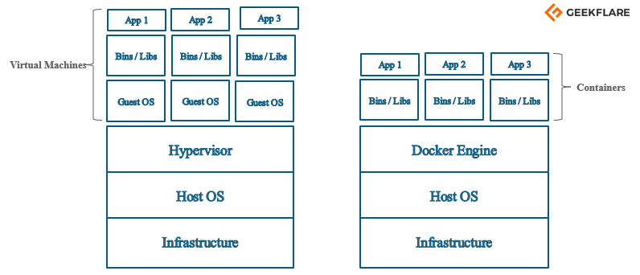

# Dokcer Concept

- 실행환경 : AWS, Ubuntu 20.04 focal, t1 


[TOC]


## Why Docker?
> 프로그램을 내려받는 과정을 간단하게 하기 위해서
> 
> 정확하게는 프로그램을 설치하는 서버, 패키지 버전, 운영체제 등에 따라서 다양한 에러가 생길 수 있는데 그것을 편하게 할 수 있도록 하는 것

<br>

### Docker 없이 Redis 설치하기

```bash
$ wget https://download.redis.io/releases/redis-6.2.6.tar.gz
$ tar xzf redis-6.2.6.tar.gz
$ cd redis-6.2.6
$ make
```

- `wget` : package, 무언가를 설치할 때 사용하는 패키지이다.

  이게 없으면 안되니까 이걸 다운로드할 필요성이 있다.
  여기서 말하고 싶은 것은 이게 복잡하다는 것이다.

<br>

### Docker 를 사용한 Redis 설치
```bash
docker run -it redis
```

- 여기에서 말하고 싶은 것은 쉽게 내려받아서 설치를 할 수 있다는 것이다.


## Docker and Container

- Docker?
  - 애플리케이션을 신속하게 구축, 테스트 및 배포할 수 있는 소프트웨어 플랫폼
  - 소프트웨어를 **컨테이너**라는 표준화된 유닛으로 패키징한다.
  - 환경에 구애받지 않고 애플리케이션을 신속하게 배포 및 확장할 수 있다.

- Container?
  - 라이브러리, 시스템 도구, 코드, 런타임 등 소프트웨어를 실행하는데 필요한 모든 것이 포함되어 있다.

by. AWS site Docker...

<br>

### What is Container?

- 다양한 프로그램과 실행환경을 컨테이너에 담는다.

  동일한 인터페이스를 제공해서 프로그램의 배포 및 관리를 단순하게 한다.

  - 뭘 넣어도 인터페이스는 같으니까 관리하기 쉬워진다는 뜻인 것 같다.


## Docker Image and Container

> Docker Container 를 만들기 위해서는 Docker Image 가 필요하다.

- Docker Container
  - 코드와 모든 종속성을 패키지화하여 <Br>
    응용 프로그램이 한 컴퓨팅 환경에서 다른 컴퓨팅 환경으로 빠르고 안정적으로 실행되도록 하는 소프트웨어의 표준 단위

- Docker Image
  - 응용 프로그램을 실행하는 데 필요한 모든 것을 포함하는 가볍고 독립적이며 실행 가능한 소프트웨어 패키지

- 결론
  - 도커 이미지가 프로그램을 실행하는데 필요한 설정이나 종속성을 가지고 있다.

    따라서 도커 이미지를 이용해서 여러 개의 도커 컨테이너를 만들 수 있다.

  - 도커 컨테이너를 도커 이미지의 인스턴스라고 부른다.
  - 도커 컨테이너를 실행하면, 컨테이너 안에서 실행하고자 하는 프로그램을  실행할 수 있다.

  - 도커 이미지를 이용해서 컨테이너를 생성한다.

    생성한 컨테이너를 잉요해서 프로그램을 실행한다.


<Br>

## Docker Install

> https://www.docker.com/
> 
> https://docs.docker.com/engine/install/ubuntu/


도서에서는 window, mac OS 환경에서 설치하는 것이 나와있지만 ubuntu 를 사용하고 있기 때문에 공식문서를 참고해서 설치를 진행한다.

<br>

### 이전 버전 제거

```bash
$ sudo apt-get remove docker docker-engine docker.io containerd runc
```

<br>

### 설치
- 여러 방식으로 Docker 를 설치할 수 있다. ( 공식문서 참조 )

  대부분 사용하는 Docker 의 리포지토를 설정하고 그곳에 설치하는 방식을 따라가겠다.

#### 저장소를 사용해서 설치하기

<br>

##### 저장소 설정
1. HTTPS 를 통해서 리포지토를 사용할 수 있도록 한다.

```bash
sudo apt-get update
sudo apt-get install \
  ca-certificates \
  curl \
  gnupg \
  lsb-release
```
2. Docker 의 공식 GPG 키 추가

```bash
curl -fsSL https://download.docker.com/linux/ubuntu/gpg | sudo gpg --dearmor -o /usr/share/keyrings/docker-archive-keyring.gpg
```

3. 저장소 설정

```bash
echo \
  "deb [arch=$(dpkg --print-architecture) signed-by=/usr/share/keyrings/docker-archive-keyring.gpg] https://download.docker.com/linux/ubuntu \
  $(lsb_release -cs) stable" | sudo tee /etc/apt/sources.list.d/docker.list > /dev/null
```

#### Docker Engine 설치

1. Docker Engine 설치

    특정 버전을 다운로드할 수 있는 방법도 있다. ( 공식문서 참조)

```bash
sudo apt-get update
sudo apt-get install docker-ce docker-ce-cli containerd.io
```

2. hello-world Image 실행해보기

```bash
# docker 버전확인하기
docker version
```


```bash
# image 실행
sudo docker run hello-world

# 해당 메시지가 출력되면 성공이다.
Unable to find image 'hello-world:latest' locally
latest: Pulling from library/hello-world
2db29710123e: Pull complete 
Digest: sha256:2498fce14358aa50ead0cc6c19990fc6ff866ce72aeb5546e1d59caac3d0d60f
Status: Downloaded newer image for hello-world:latest

Hello from Docker!
This message shows that your installation appears to be working correctly.

To generate this message, Docker took the following steps:
 1. The Docker client contacted the Docker daemon.
 2. The Docker daemon pulled the "hello-world" image from the Docker Hub.
    (amd64)
 3. The Docker daemon created a new container from that image which runs the
    executable that produces the output you are currently reading.
```

## Docker Use Flow

- 도커를 사용하는 흐름

  1. 도커 클라이언트 ( CLI ) 에 원하는 명령을 위한 명령어를 입력한다.
  2. 도커 서버 ( 도커 데몬 ) 가 도커 클라이언트에서 입력한 명령어를 전달받는다.
  3. 도커 서버는 명령어에 따른 이미지를 생성하고 컨테이너를 실행한다.
  4. 실행된 컨테이너에서 애플리케이션을 실행한다.


- docker run hello-world ( Docker engine install 부분 확인 )
  1. CLI 명령어 입력, 클라이언트에서 도커 서버롤 요청
  2. 서버에서 hello-world 이미지가 로컬에 다운로드 되어있는지 확인
  3. hello-world 이미지가 로컬에 없다는 것을 확인
  4. 도커 허브 ( Docker hub ) 에서 hello-world 이미지를 가져오고 로컬에 보관
       - 이미지 캐시 보관 장소에 hello-world 이미지가 없다면 도커허브에서 가져온다는 뜻 
  5. 이미지를 이용해서 컨테이너 생성
  6. 생성된 컨테이너는 이미지에서 받은 것에 맞게 프로그램 실행

<Br>

## Docker VS 기존의 Virtualization ( 가상화 )

- 가상화라는 키워드에 대한 공부도 해야하지만, 일단은 Go

<Br>

### 가상화 기술이 나오기 전에 서버를 사용하는 방식
- 한 대의 서버를 하나의 용도로만 사용한다.

    한 대의 서버에서 사용하고 남는 서버 공간은 방치하게 된다.

    하나의 서버, 하나의 운영체제, 하나의 프로그램

    안정적이나 비효율적이다.

<Br>

### 하이퍼바이저 기반의 가상화 기술
- 하이퍼바이저
  - 논리적으로 공간을 분할하여 가상머신 ( VM ) 이라는 독립적인 가상 환경에서 서버를 이용하는 기술
  - 호스트 시스템에서 다수의 게스트 운영체제 ( OS ) 를 구동할 수 있도록 하는 소프트웨어
  - 하드웨어를 가상화하면서 각각의 가상머신 ( VM ) 을 모니터링하는 중간 관리자
  - 한 대의 서버를 하나의 용도로 사용했던 비효율적인 부분 개선

<Br>

#### 하이퍼바이저의 종류
> 종류 : 네이티브 하이퍼바이저, 호스트형 하이퍼바이저

- 네이티브 하이퍼바이저
  - 하이퍼바이저가 하드웨어를 직접 제어한다. ( 자원을 효율적으로 사용할 수 있다. )
  - 호스트 OS 가 없어서 오버헤드가 적다.
  - 하드웨어 드라이버를 세팅해야 하므로 설치가 어렵다.

<Br>

- 호스트형 하이퍼바이저
  - 호스트 OS 위에서 실행된다. 하드웨어 자원을 VM 내부의 게스트 OS에 에뮬레이트 하는 방식
  - 오버헤드가 크다.
  - 게스트 OS 종류에 대한 제약이 없다.
  - 구현이 다소 쉽다. ( 현재 많은 사람들이 사용 )


##### 호스트형 하이퍼바이저


출처 : https://library.gabia.com/contents/infrahosting/7426/


- 특징
  - 하이퍼바이저에 의해 구동되는 가상 머신은 각 가상 머신마다 독립된 가상 하드웨어 자원을 할당받는다.
    - 그림에서 CPU 와 NIC( Network Interface Card ) 가 각각 따로 분할되어서 할당되어 있는 것을 볼 수 있다.
      이게 독립된 가상 하드웨어 자원을 할당받는다는 이야기 이다.
  - 논리적으로 분리되어있어서 하나의 가상머신에 오류가 발생해도 다른 가상머신으로 오류가 퍼지지 않는다.


### Docker




출처 : https://pasudo123.tistory.com/398


- 특징
  - 도커의 구조와 가상화 기술의 구조가 비슷하다.
    - 기본 하드웨어에서 격리된 환경 내에 애플리케이션을 배치한다는 점에서 공통점을 가진다.
    - **격리된 환경을 얼마나 격리시키는지가 다르다.**


#### Docker Container VS Virtual Machine


##### Virtual Machine

- 가상머신 내부에서 실행되는 모든 것은 호스트 운영체제 또는 하이퍼바이저와 독립되어 있다.
- 가상머신을 시작할 때, 가상 머신 환경을 위한 커널을 부팅하고 운영체제 프로세스 세트를 시작해야한다. ( 도커와의 차이점 )
  - 응용 프로그램만 포함하는 컨테이너보다 VM의 크기가 더 크다.
  - 느리다.


##### Docker Container

- 특징
  - 같은 호스트의 다른 컨테이너와 동일한 커널을 공유한다.
  - 컨테이너 내부에서 실행되는 프로세스는 호스트 시스템 ( 충분한 권한이 있다는 전제하에 )에서 볼 수 있다.
  - 컨테이너가 전체 OS를 내장할 필요가 없기 때문에 컨테이너가 매우 가볍고 일반적으로 용량이 아주 작다.

- 비교결과
  - 도커 컨테이너는 하이퍼바이저와 게스트 OS가 필요하지 않으므로 더 가볍다.
  - 실행하는 과정이 다르다.
    - 컨테이너는 애플리케이션을 실행할 때 호스트 OS 위에 애플리케이션의 실행 패키지인 이미지만 배포하면 된다.
    - 가상 머신은 애플리케이션을 실행하기 위해서 가상 머신을 실행하고 자원을 할당한 후 게스트 OS를 부팅해서 애플리케이션을 실행해야 한다.
      따라서 가상머신이 컨테이너보다 복잡하고 무겁다.


## Docker Container? ( Concept )

> 도커 컨테이너가 내부에서 실행되고 다른 컨테이너와 동일한 커널을 공유한다는 것은 알겠다.
> 또한 분리되어서 실행되기 때문에 다른 컨테이너에 영향을 주지 않는 것도 알겠다.
>
> 그렇다면 하드웨어에서도 격리되고 컨테이너에서도 격리되어서 실행되고 있다는 것인데, 어떻게 해서 도커 컨테이너를 격리시키는 것일까??
>
> 우리의 의문은 리눅스 제공하는 Cgroup ( Control Group ) 과 네임스페이스 ( Namespaces ) 가 해결해줄 것이다. 


### Cgroup & Namespaces

> Cgroup 과 Namespaces 는 컨테이너와 호스트에서 실행되는 다른 프로세스 사이에 벽을 만드는 리눅스 커널의 기능이다.

- 다른 프로세스 사이에 벽을 만드는 리눅스 커널의 기능


- Cgroup
  - CPU, Memory, 네트워크 대역폭, HD I/O 등 프로세스 그룹의 시스템 리소스 사용량을 관리한다.
  - 예시
    - 어떤 애플리케이션의 사용량이 너무 많다면 그 애플리케이션을 Cgroup 배치해서 CPU와 메모리 사용을 제한할 수 있다.
- 네임스페이스
  - 하나의 시스템에서 프로세스를 격리시킬 수 있는 가상화 기술로 별개의 독립된 공간을 사용하는 것처럼 격리된 환경을 제공하는 경량 프로세스 가상화 기술


- 설명
  - 하나의 컨테이너는 다른 컨테이너와 격리되며 그안에 실행되는 프로세스를 작동시키기 위해서 필요한 양에 맞는 하드 디스크, 네트워크, RAM 등이 할당되어 있다.
  - 격리된 컨테이너에서 프로세스를 작동시키는 데 필요한 양만큼 하드웨어를 할당할 수 있는 것은 리눅스 커널에 있는 Cgroup과 네임스페이스 기능을 이용하기 때문이다.


### How to Make Container by Docker Image?

- 도커 이미지는 응용 프로그램을 실행하는데 필요한 모든 것을 포함한다.
  따라서 도커 이미지를 이용해서 도커 컨테이너를 생성하고 애플리케이션을 생성할 수 있다.
  **그렇다면 이미지가 포함하고 있는 필요한 모든 것은 무엇일까??**


#### 응용프로그램을 실행하기 위해서 필요한 것

1. 실행할 명령어

   - 컨테이너가 시작될 때 애플리케이션을 실행할 명령어가 필요하다.

2. 파일 스냅숏

   - 파일 스냅숏 : 디렉터리나 파일을 복사한 것

   - 명령어만 있고 그것을 실행할 애플리케이션이 없다면 실행할 수 없다.

- 결론
  - 이미지에는 시작 시 실행할 명령어와 파일 스냅숏이 필요하다.


#### Docker Container 생성 순서


1. 도커 클라이언트에 명령어 입력

   ```bash
   sudo docker run hello-world
   ```

2. 도커 이미지에 있는 파일 스냅숏를 컨테이너에 있는 하드디스크로 옮겨준다.
   컨테이너 안에서 애플리케이션을 설치하고 실행해야하기 때문에 컨테이너로 이동시킨다.

3. 도커 이미지에서 가지고 있는 명령어를 컨테이너에 전달한다.
   컨테이너가 실행될 때 사용할 명령어를 말한다.

4. 컨테이너가 실행될 때 명령어를 이용해서 hello-world 애플리케이션을 실행한다.


#### Cgroup, 네임스페이스를 쓸 수 있는 이유

> 도커 환경에서 컨테이너들을 격리시킬 수 있는 이유가 Cgroup과 네임스페이스를 이용하기 때문이라고 하는데...
>
> Cgroup과 네임스페이스는 리눅스 환경인데 윈도우나 macOS 에서는 어떻게 격리되는 것일까??

- 윈도우나 MacOS 환경에서 실제로 확인할 수 있다.

  ```bash
  docker version
  # 결과
  # ...
  OS/Arch : linux/amd64
  ```

  - 윈도우나 macOS 환경 이어도 도커 서버는 리눅스 VM 환경에서 실행되고 있다.
  - 모든 컨테이너가 리눅스 가상 머신에서 생성되며, 리눅스 커널이 컨테이너를 격리시키고 리소스를 나눠준다.

