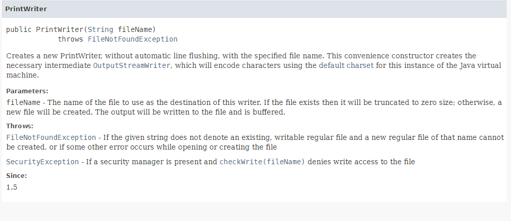

## Instance

### 개념

- **하나의 클래스를 복제해서 서로 다른 데이터의 값과 서로 같은 메소드를 가진 복제본을 만드는 것이다**
- 어떤 내부적인 상태를 말하는 것을 통해서 지칭하는 것을 다르게 유지할 수 있다.
- 하나의 클래스를 사용하는 것보다는 하나의 클래스를 `new`를 통해서 복제하는 것으로 변수에 담아서 사용하는 것이 더 효율적일 수 있다.
  - 복제한 클래스가 장기적, 반복적으로 사용될 수록 더 효율적으로 사용될 수 있다.
- Math vs PrintWriter
  - Constructors : Instance 로 사용하기위해서 받는 것
    - Math : Constructors X
    - PrintWriter : Constructors O
      - Constructor를 사용해서 Instance 를 만드는 것이 허용되어있다.
      - 
        - 이런 식으로 다 나와있다!
        - 어떤 값이 들어와야하는지, 어떤 에러가 날 수 있는지 등

### Constructor

- 생성자

- new 연산자와 같이 사용되어 클래스로부터 객체를 생성할 때 호출되어 객체의 초기화를 담당한다.

- 인스턴스 변수의 초기화 작업에 주로 사용되며, 인스턴스 생성 시에 실행되어야 할 작업을 위해서도 사용된다.

  

### 실습1

- ```java
  public class InstanceApp {
  
  	public static void main(String[] args) {
  		// TODO Auto-generated method stub
  		
  		PrintWriter p1 = new PrintWriter("result1.txt");
  		
  	}
  
  }
  
  ```

  - `new PrintWriter` : PrintWriter 의 복제본, 아바타를 만든다.
  - `p1` : 복제본, 아바타를 변수에 담다. 이 변수에 담겨져 있는 어떠한 무엇인가를 PrintWriter 라는 class 의 인스턴스라고 한다.
  - `PrintWriter p1` : 이 변수에는 PrintWriter 라는 형식만 들어가도록 규제하기 위해서.

- 에러 없애기

  1. 불러오기

     - 	import java.io.PrintWriter;
         	
         	public class InstanceApp {
        	
        		public static void main(String[] args) {
        			// TODO Auto-generated method stub
        			
        			PrintWriter p1 = new PrintWriter("result1.txt");
        			
        		}
        	
         	}

       - Math 와 다르게 PrintWriter 는 패키지를 가져오는 작업을 해야한다.

  2. 예외상황

     - 파일을 읽으려고 하는데 파일이 없으면 문제가 생길 수가 있다. => 예외상황
     - 만약 이 상황에서 파일이 없어서 빨간 줄이 나온다면?
       - 
         - 마우스 대고 `Add throws declaration` 선택


### 실습2 - instance 만들어 보기

- 버그 유발 가능성이 큰 코드
  이러한 코드는 계속 하나가 수정되고 있는 것이기 때문에 좀 위험하다!

  ```java
  Accounting.valueOfSupply = 10000.0;
  Accounting.vatRate = 0.1;
  Accounting.expenseRate = 0.3;
  Accounting.print();
  
  Accounting.valueOfSupply = 20000.0;
  Accounting.vatRate = 0.05;
  Accounting.expenseRate = 0.2;
  Accounting.print();
  
  Accounting.valueOfSupply = 10000.0;
  Accounting.vatRate = 0.1;
  Accounting.expenseRate = 0.3;
  Accounting.print();
  ```

- 해결하기

  1. 새로운 class 만들기

     - ```java
       Accounting1.valueOfSupply = 10000.0;
       Accounting1.vatRate = 0.1;
       Accounting1.expenseRate = 0.3;
       Accounting1.print();
       
       Accounting2.valueOfSupply = 20000.0;
       Accounting2.vatRate = 0.05;
       Accounting2.expenseRate = 0.2;
       Accounting2.print();
       
       Accounting3.valueOfSupply = 10000.0;
       Accounting3.vatRate = 0.1;
       Accounting3.expenseRate = 0.3;
       Accounting3.print();
       ```

       - 일일이 만드는 것도 하나의 방법이 될 수 있다.

  2. class 복제하기 Instance

     - ```java
       Accounting a1 = new Accounting(); 
       a1.valueOfSupply = 10000.0;
       a1.vatRate = 0.1;
       a1.expenseRate = 0.3;
       a1.print();
       
       Accounting a2 = new Accounting();
       a2.valueOfSupply = 10000.0;
       a2.vatRate = 0.1;
       a2.expenseRate = 0.3;
       a2.print();
       ```

       - 이것을 instance라고 부른다

     - **주의할 점!!!**

       - instance를 만드는 class 에는 `public static ~~` 에서 `static`을 제외시켜야 한다.

       - ```java
         class Accounting {
         	public double valueOfSupply;
         	public double vatRate;
         	public double expenseRate;
         	
         	public void print() {
         		System.out.println("Value of supply : " + valueOfSupply); 
         		System.out.println("VAT : " + getVAT()); 
         		System.out.println("Total : " + getTotal());
         		System.out.println("Expense : " + getExpense());
         		System.out.println("Income : " + getIncome());
         		System.out.println("Dividend 1 : " + getDividend1());
         		System.out.println("Dividend 2 : " + getDividend2());
         		System.out.println("Dividend 3 : " + getDividend3());
         	}
         	public double getDividend1() {
         		return getIncome() * 0.5;
         	}
         
         	public double getDividend2() {
         		return getIncome() * 0.3;
         	}
         
         
         	public double getDividend3() {
         		return getIncome() * 0.2;
         	}
         
         	public double getIncome() {
         		return valueOfSupply - valueOfSupply * expenseRate;
         	}
         
         	public double getExpense() {
         		return valueOfSupply * expenseRate;
         	}
         
         	public double getTotal() {
         		return valueOfSupply + getVAT();
         	}
         
         	public double getVAT() {
         		return valueOfSupply * vatRate;
         	}
         }
         ```

     

