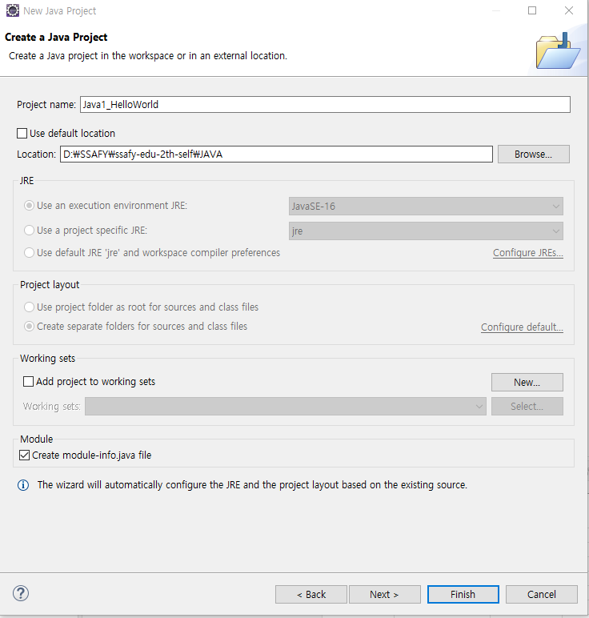
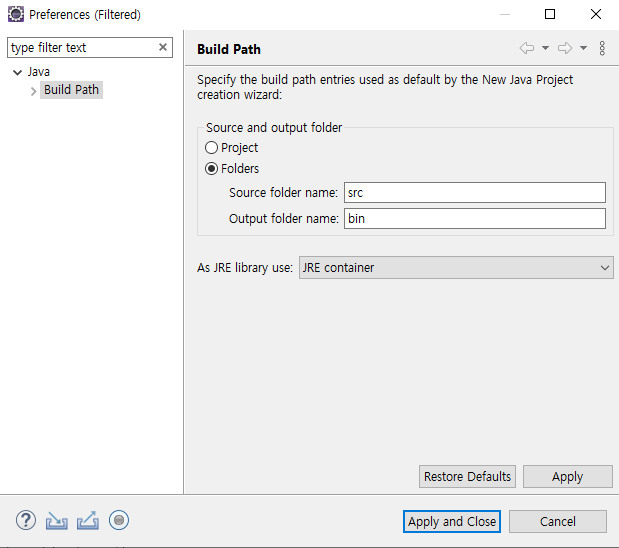
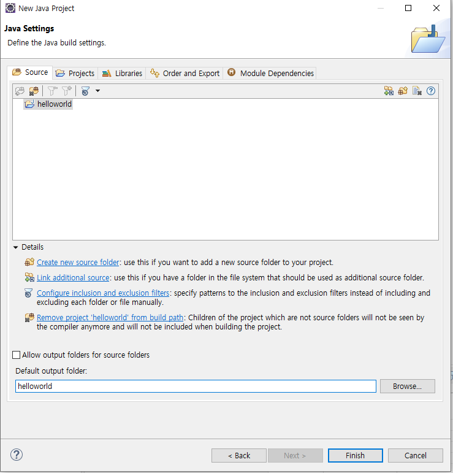
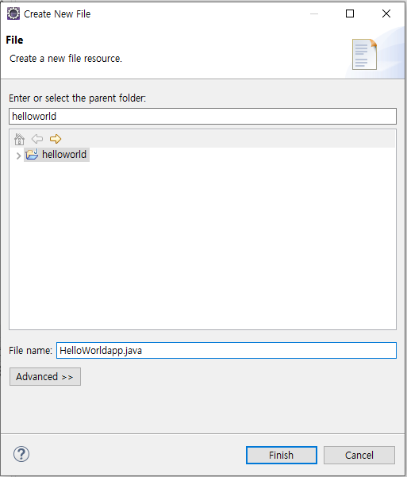
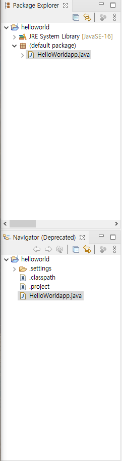
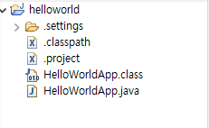
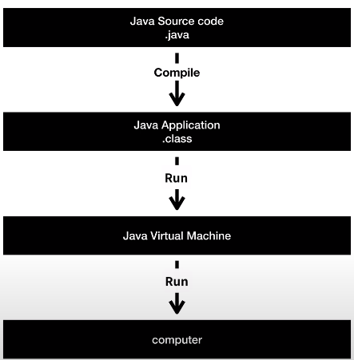
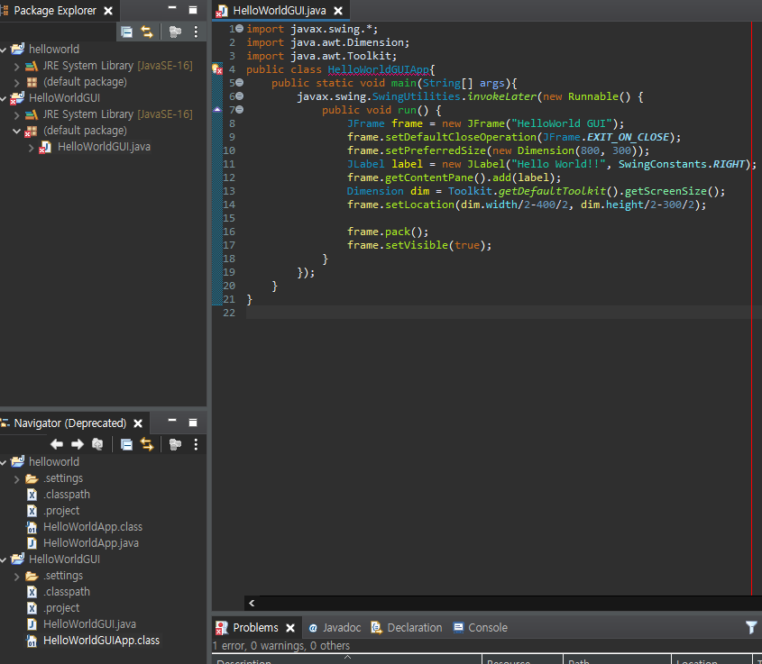

# JAVA 2. START


- 화면 셋팅
  1. 좌측 박스 셋팅
     - Window - Show View - Navigator
       - Package Explorer : 프로젝트의 구조를 조금 가공해서 보여준다.
       - Navigator : 프로젝트의 구조를 있는 그대로 보여준다.


## Java 시작하기


- File - New - Java Project
- 
  - Location 을 먼저 설정하고 프로젝트 이름을 지어주는 것이 좋다.
  - JRE (Java Runtime Environment)
    - 설정 안해도 된다.
  - Project layout
    - 프로젝트 폴더의 구조를 어떻게 할 것인가
    - 소스코드를 저장할 폴더
    - 소스코드를 컴파일 한 것을 저장할 폴더
    - 각 선택지
      1. 프로젝트 최상위 디렉토리와 소스코드와 컴파일을 같은 곳에 두겠다
      2. 다른 곳에 두겠다.
         - 
           - 소스코드는 src
             컴파일된 것은 bin
  - 
    - 소스코드 : 위의 폴더 아이콘
    - 컴파일 : `Default ouput folder`


### point : Location 설정해주기

- Location 을 그냥 설정했더니 JRE 와 Project  layout이 설정이 안되는 현상이 벌어졌다.
- 해결법
  1. `D:\SSAFY\ssafy-edu-2th-self\JAVA` 까지 설정한다.
  2. `\java2_helloworld` 이 부분은 수기로 작성해준다. 


## Java 파일 만들기

1. Package Explorer, Navigator 에서 프로젝트 폴더 우클릭 -> New 
   - 
   - 
     - 각각 보이는 것이 다르다.


## java code!


```java
public class HelloWorldApp {
	public static void main(String[] args ) {
		System.out.println("Hello World!!");
	}
}
```

- class 뒤에 들어가는 것은 반드시 파일명과 같아야 한다.
- 실행했을 때 java 는 파일의 이름과 같은이름을 지닌 class 를 찾아가서
  main 이라는 이름을 지닌 메소드라는 것을 찾는다.
  그 중간에 있는 것을 코드를 실행시킨다.


```java
System.out.println("Hello World!!")
```

- 시스템에게 말한다. / 밖으로. / 출력한다.


- 저장을 하면??
  - 
    - `.class`라는 것이 달리는 데, 이것은 실행하기 위해서 나온 것이다. 보이지는 않음!
      - 이게 컴파일된 것 같다. 코드를 작성해서 저장을 하면 그 소스코드를 컴파일해서 `.class`라는 이름으로 만들어서 저장해놓아서 실행할 때 `.class`를 실행하는 것 같다.


### point : `;`

- ```console
  Exception in thread "main" java.lang.Error: Unresolved compilation problem: 
  	Syntax error, insert ";" to complete BlockStatements
  
  	at HelloWorldApp.main(HelloWorldApp.java:3)
  
  ```

  - `;` 콜론을 사용하자.


## Java 실행 원리

- source, code, language
  - 원인을 부르는
- application, program
  - 결과를 부르는

- 일단 우리는 source, code 등을 통해서 application, program 이라는 결과를 얻고 싶은 사람들이다.




- Compile

  - 사람이 이해하는 것을 source code 라고 하는데 기계는 그것을 이해하지 못한다.

    그래서 사람이 이해할 수 있는 것을 기계가 이해할 수 있도록 바꾸는 작업을 해야한다.

  - Java Application `.class` 

    - 이 파일이 바로 컴파일 된 것이다.

- Run

  - Complie 된 것을 Java Virtual Machine 으로 보내고 Virtual Machine 에서 computer 로 가는 것


## Point : Java 가 어떻게 저장되는가?



1. code 상에서 `public class HelloWorldGUIApp` 을 보자
2. Navigator 상에서 `HelloWorldApp.class`를 보자

- java 파일이름은 `HelloWorldGUI`인데 왜 `.class` 파일을 `HelloWorldGUIApp`일까????
  - 아무래도 `public class` 를 따라가는 것 같다.


