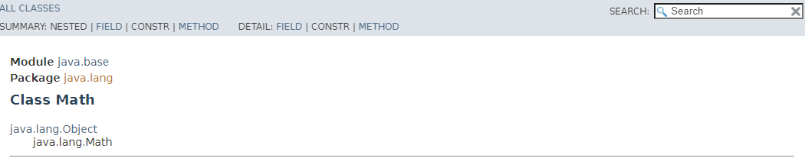
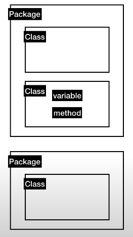

# Java 8. How to read Java document

- **API**(Application Programming Interface)
  - Java Program 을 만드는 것은 자바가 제공하는 기본 라이브러리를 실행되도록 하는 것을 통해서 하는 것이다.
  - 이러한 맥락에 자바가 기본적으로 제공하는 기능들을 조작하는 방법을 Application Programming Interface 라고 한다.
- **UI**(User Interface)
  - 만든 프로그램을 사용하는 유저를 위한 조작 방법을 User Interface 라고 한다.
  - 프로그램을 사용하는 주체가 유저가 아니라면?? API 라고 한다!

## Documentation 

1. `api documenation java 11` 검색

2. 패키지 확인하기
   - 
     - Math 라는 class 는 java.lang 이라는 패키지에 들어가 있다.
   - Package
     1. 많은 Class 들을 한 곳에서 관리하는 것보다는 여러 곳으로 나눠서 관리하는 것이 좋다.
     2. 또한 동일한 이름으로 Class 를 만들어야 할 시에 같은 곳에서 관리하는 것보다는 여러 곳에 있는 것이 좋다.
     3. 그래서 각 package 들에는 서로 비슷한 것들이 모여있다.
   - Class
     1. 서로 연관된 변수와 메소드라는 것을 모아서 거기에다가 이름을 붙인 것이다. (그룹핑)
   - 
     - [생활코딩 13.2](https://www.youtube.com/watch?v=kSH6-DU68fo&list=PLuHgQVnccGMAIluRRVsC1e79ri-dwnBmR&index=35)
