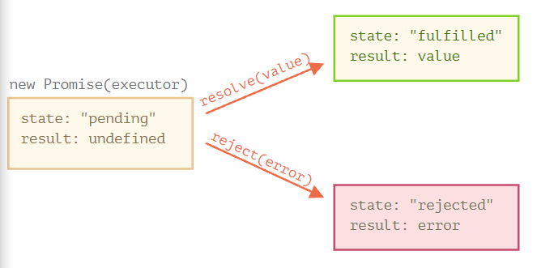
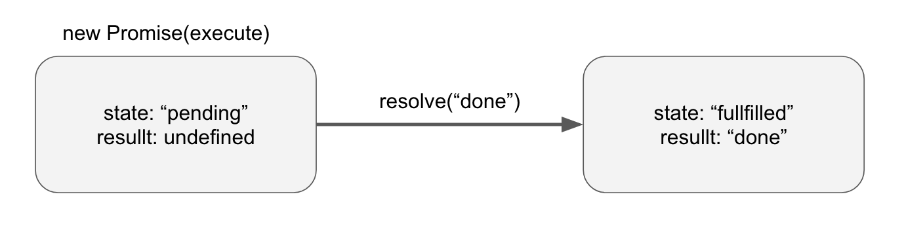
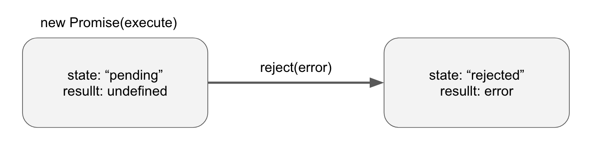

# JavaScript Promise

> ES6 에서 부터 추가된 비동기 처리 방식
>
> 비동기 작업의 단위

## 설명

`Promise` 비동기 작업을 처리하는 방식으로 ES6부터 추가되었다.

제작코드 (producing code), 소비코드(consuming code), 프라미스(promise) 부분으로 나누어서 설명할 수 있다.

- 제작코드는 실행할 코드를 말하며,
  소비코드는 제작코드의 결과에 따라서 실행할 코드를 말한다.
  프라미스는 제작코드와 소비코드를 연결해주는 자바스크립트 객체를 말한다.
  프라미스는 시간이 얼마나 걸리던지 상관없이 제작코드의 결과에 따라서 모든 소비코드가 제작코드의 결과를 사용할 수 있도록 해준다.

`Promise`는 비동기 작업의 단위이다.

Callback 을 중첩시키는 것은 Callback 지옥을 만들어낸다. Callback 지옥을 해결할 수 있는 것이 Promise 이다.

```js
let promise = new Promise(function(resolve, reject){
  // executor ( 제작 코드 = producing code)
})
```

- `new Promise`에 전달되는 함수를 executor (실행자, 실행함수) 라고 부른다.
- executor 는 `new Promise`가 만들어질 때, 자동으로 실행된다.
- `resolve`, `reject`는 자바스크립에서 자체 제공하는 콜백이다.
  - 개발자는 해당하는 인수(`resolve`, `reject`)를 신경쓰지 않고 executor 부분을 개발하면 된다.
- **executor 에서는 결과를 언제 얻든지 상관없이 상황에 따라서 넘겨준 콜백 중 하나를 반드시 호출해야 한다.**
  - `resolve(value)` : 일이 성공적으로 끝난 경우에는 결과를 나타내는 `value`와 함께 호출한다.
  - `reject(error)` : 에러 발생 시에는 에러 객체를 나타내는 `error`와 함께 호출한다.

**executor는 자동으로 실행되며, 여기에서 원하는 일이 처리된다. 처리가 끝나면 executor는 처리 성공 여부에 따라서 `resolve`나 `reject`를 호출한다.**

### Promise states

`Promise` 객체는 state, result 라는 내부 프로퍼티를 가진다.

- `state`

  처음에는 `"pending"` ( 보류 ) 였다가 `resolve` 가 호출되면 `"fullfilled"` , `reject` 가 호출되면 `"rejected"`로 변한다.

- `result`

  처음에는 `undefined` 였다가 `resolve(value)`가 호출되면 `value`로 `reject(error)`가 호출되면 `error`로 변한다. 

`Promise` 객체에는 `"pending"`, `"fullfilled"`, `"rejected"` 총 3개의 상태가 존재한다.

- `"pending"` : 이행하지도 거부하지도 않은 초기상태
- `"fullfilled"` : 연산이 성공적으로 완료된 상태
- `"rejected"` : 연산이 실패한 상태



[^promise_executor]: https://velog.io/@tastestar/Promise%ED%94%84%EB%9D%BC%EB%AF%B8%EC%8A%A4

- executor 는 `Promise`의 상태를 둘 중 하나로 변화시킨다.


#### fullfilled promise

```js
let promise = new Promise(function(resolve, reject) {
    setTimeout(() => resolve("done"), 1000);
});
```

- 처리과정
  1. executor는 `new Promise`에 의해서 자동으로, 즉각적으로 호출된다.
  2. executor에 의해서 처리가 시작된지 1초 후에 ( `setTimeout` 에 의하여 ) `resolve("done")`이 호출되고 결과가 만들어진다.
  3. `promise`객체의 상태가 변한다.



- `resolve("done")`이 호출된 상황을 나타낸 그림
- executor에서 처리된 부분이 성공적인 `Promise` 객체는 fullfilled promise (약속이 이행된 프라미스 객체) 라고 불린다. 


#### rejected promise

```js
let promise = new Promise(function(resolve, reject){
    setTimeout(() => reject(new Error("Error !")), 1000);
});
// VM628:2 Uncaught (in promise) Error: Error ! at <anonymous>:2:29
```

- 처리 과정
  1. executor 는 자동적으로, 즉각적으로 호출된다.
  2. executor에 의해서 처리가 시작된지 1초 후에 ( `setTimeout` 에 의하여 ) `reject(Error)`가 호출되고 에러가 만들어진다.
  3. `promise`의 상태가 변한다.



- `resolve(error)` 가 된 `promise`를 그린 그림
- executor 부분에서 처리된 부분이 실패한 `promise`객체는 rejected (거절된) 상태에 있다고 표현된다.

## 주의점

### 프라미스는 성공또는 실패로만 나뉜다.

executor는 반드시 `resolve` `reject` 중 하나를 호출해야한다.
또한 변경된 상태는 더 이상 변하지 않는다.

```js
let promise = new Promise(function(resolve, reject){
   resolve("done"); // 동작함
    reject(new Error("error!")); // 무시
    setTimeout(() => resolve("do!")); // 무시
});
promise // Promise {<fulfilled>: 'done'}
```

- 처리가 끝난 `promise` 에 `resolve`, `reject`를 호출해도 동작하지 않는다.

### state, result 는 내부 프로퍼티 이다.

- state, result 는 promise 객체의 내부 프로퍼티이다.
  따라서 개발자가 접근하기 어렵다.
  - 접근하기 위해서는 `.then`, `.catch`, `.finally` 메서드를 사용하는 것이 필요하다.

## Promise의 결과를 받아 줄 `.then`, `.catch`, `.finally` 

`promise` 객체는 executor와 그 실행결과나 에러를 받을  소비함수를 이어주는 역할을 한다.

여기에서 소비함수는 `.then`, `.catch`, `.finally`  를 말한다.


### `.then`

executor 에서 결과가 실행되었을 때를 연결해주는 메서드

```js
promise.then(
  function(result) {/* 결과를 처리하는 부분 */},
  function(error) {/* 에러를 처리하는 부분 */}
);
```

- `.then`의 첫 번째 인수는 `promise`가 이행된(fullfilled) 상태일 때, 실행되는 함수이다.
- `.then`의 두 번째 인수는 `promise`가 거부된(rejected) 상태일 때, 실행되는 함수이다.

```js
let promise = new Promise(function (resolve, reject) {
    setTimeout(() => {
        resolve("done!"), 1000
    })
})
promise.then(
    result => alert(result), // 실행된다.
    error => alert(error) // 실행되지 않음.
);
Promise {<fulfilled>: undefined}
```

- `promise`가 fullfilled 상태일 때는  `then`의 첫 번째 인수에 있는 부분이 실행된다.
- 작업이 성공한 경우만 다루고 싶다면, 에러처리를 하지 않는다면 `.then`에 인수를 하나만 전달하면 된다.

```js
let promise = new Promise(function (resolve, reject) {
    setTimeout(() => {
        reject(new Error("Error!!")), 1000
    })
})
promise.then(
    result => alert(result),
    error => alert(error) // alert 가 실행된다.
);
Promise {<fulfilled>: undefined}
```

- `promise`가 rejected 상태일 때는  `then`의 두 번째 인수에 있는 부분이 실행된다.

### `.catch`

에러가 발생하는 경우를 다룰 때, 사용하는 메서드

`.then(null, errorHandlerFunction)` 의 형식으로 `.then`의 첫 번째 인수로 `null`을 전달해도 된다.
(동일하게 작동한다.)

```js
let promise = new Promise(function (resolve, reject) {
    setTimeout(() => {
        reject(new Error("Error!!")), 1000
    });
});
promise.catch(alert); // alert 가 실행된다.
Promise {<fulfilled>: undefined}
```

- `.catch(handlerFunctoin)` === `.then(null, handlerFucntion)`
  문법이 다르다는 것 빼고는 완벽하게 같다.

### `finally`

프라미스가 처리되면 항상 실행되는 메서드

`.finally( handlerFunction )` = `.then( handlerFunction, handlerFunction )`

```js
new Promise((resolve, reject) => {
    setTimeout(() => { resolve("Hello!")}, 1000);
})
.finally(() => {console.log("finally")})
.then( result => console.log(result));
Promise {<pending>}
// finally
// Hello!
```

- `finally` 와 `then`의 차이점
  - `finally` 에는 인수가 없다.
    `finally`는 절차를 마무리하는 보편적인 동작을 하기 때문에 성공 실패여부를 몰라도 된다.
  - `finally` 핸들러는 자동으로 다음 핸들러에 결과와 에러를 전달한다.

## 왜 `promise`를 사용하는가?

1. 흐름이 자연스러워 진다.
   - 결과에 따라서 `.then`, `.catch`를 사용하면 된다. ( callback 함수는 호출하기 전에 호출할 것에 대해서 미리 알아야 한다. )
2. 원하는 만큼 `.then`을 붙여주면 된다.
   - 하나 이상으로 사용할 수 있다. ( callback 은 하나만 가능하다. )


## 참조

- https://ko.javascript.info/promise-basics
- https://developer.mozilla.org/ko/docs/Web/JavaScript/Reference/Global_Objects/Promise
- https://elvanov.com/2597

