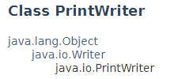
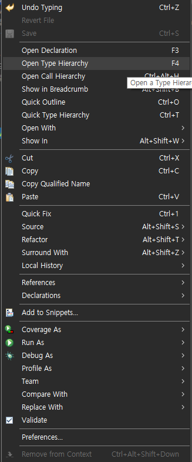
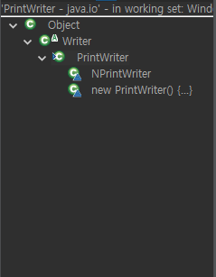
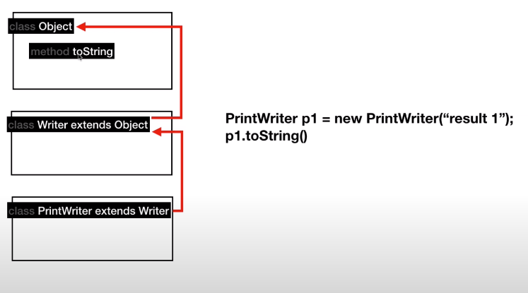
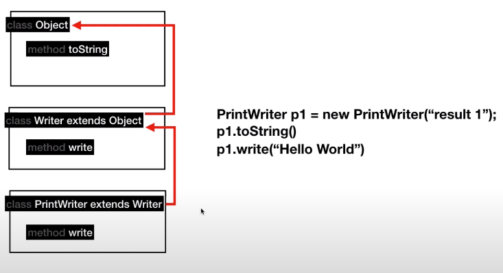
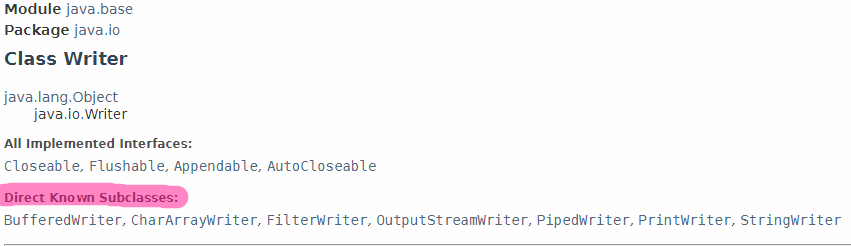
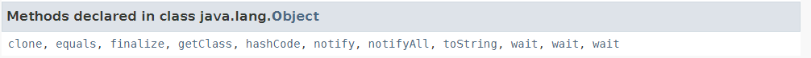

# Java 11. Inheritance

- 
  - PrintWriter 는 Writer 를 상속받는다. (Writer 는 PrintWriter 의 부모다.)
  - Writer 는 Object 를 상속받는다. 
- 뭔가를 만드는데, 이미 있는 것을 가지고 거기에서 더 추가해서 만들 수도 있잖아?
  0에서 100 까지 다 만들 수는 없다고????
  - 그러면 상속받아서 GO!
- 상속받은 것 확인하기
  - 
  - 
- 상속받은 것은 어떻게 실행되는가?
  - 
    - `toString()` 실행하기
      1. PrintWriter 에서 `toString()` 찾는다. -> 없다.
      2. Writer 에서 `toString()` 찾는다. -> 없다.
      3. Object 에서 `toString()` 찾는다. -> 있다.
      4. 실행한다.

## Override

- 
  - 이 경우에는 Object 의 `write()`가 Writer 에서 사용된 기능과는 좀 다를 때, Writer 에서 `write()` 를 덮어쓰기 한 것이다.
  - 실행이 되는 것도 Writer 의 `write()`  가 실행된다. (Object 의 `write()` 를 지정하지 않는 한)

## Tree

- 상속의 트리를 보여준다. 
- Object 가 가장 최상위에 있는 것으로 모든 것의 기반? 이 되는 것이다.
  - Object 가 어떤 것을 가지고 있는지 보는 것도 좋다.

## Known Subclasses

- 
  - 이런 것도 있다는 뜻인데, 표준 라이브러리가 아니라는 점!
  - 누구나 만들 수 있으니까 가장 알려진 것이라고 표시하는 것이다.

## 상속받은 것들

- 
  - 이런 것들을 통해서 확인할 수 있다.

