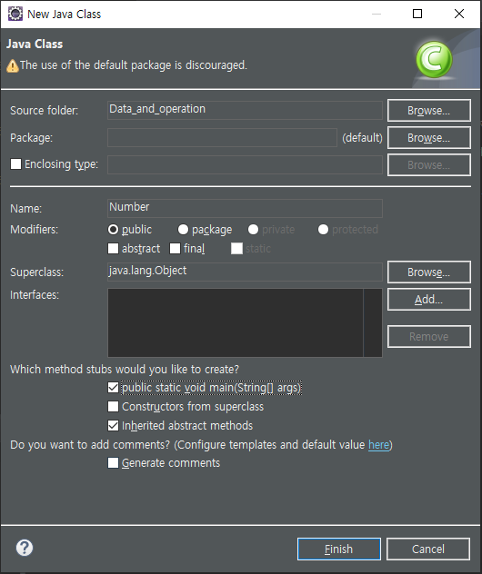

## JAVA 2. DATA

- 컴퓨터는 어떤 데이터를 다룰 수 있을까?
  1. 숫자
  2. 문자
  3. 기타 등등 (영상, 소리..)
- 왜 구분할까?
  - 각각의 데이터마다 그 것을 처리할 수 있는 다양한 방식의 처리방법이 있기 때문이다.
    - 숫자 :  +, - ...
    - 문자 : 길이, 검색 ...


## 목표

1. 해당 시스템에 어떤 데이터 타입이 존재하는지 알아가는 것
2. 각각의 데이터타입별로 어떤 연산방법들이 존재하는지 알아가는 것


## Number 와 String

```java
public class Datatype{
	public static void main (String[] args) {
		System.out.println(6); // Number 숫자
		System.out.println("six"); // String 문자열
		
		System.out.println("6"); // String 6
		System.out.println(6+6); // 12
		System.out.println("6" + "6"); // 66 String 에 + 는 결합 연산자로 합쳐진다.
		System.out.println(6*6); // 36
//		System.out.println("6" * "6"); // String 이라는 type 은 * 곱하기를 하지 못한다.
		
		System.out.println("1111".length()); // 4 .length() 문자열의 길이를 알려주는 것
//		System.out.println(1111.length()); // 숫자형의 길이를 알아내는 것은 없다. 
	}
}
```

- 각 data type 에 따라서 할 수 있는 실행, 연산이 다르다.


## Tip : 쉽게 파일 추가하기

1. 우클릭 -> New -> Class

2. 

   - 중간의 `public static void main(String[] args)`를 사용하면 번거로운 것도 한번에 추가해준다.

3. 결과

   - ```JAVA
     
     public class Number {
     
     	public static void main(String[] args) {
     		// TODO Auto-generated method stub
     
     	}
     
     }
     ```


## Number and operation

- ```java
  
  public class Number {
  
  	public static void main(String[] args) {
  		// TODO Auto-generated method stub
  		
  		// 연산자 Operator
  		System.out.println(6 + 2 ); // 8
  		System.out.println(6 - 2); // 4
  		System.out.println(6 * 2); // 12
  		System.out.println(6 / 2); // 3
  		
  		// 이클립스는 Math. 을 했을 때, 각 기능을 보여주고 도움말을 보여준다.
  		System.out.println(Math.PI); // 3.141592653589793
  		System.out.println(Math.floor(Math.PI)); // 3.0 내림
  		System.out.println(Math.ceil(Math.PI)); // 4.0 올림
  	}
  
  }
  
  ```


## Tip : 이클립스 세로줄 없애기

- Window -> Preferences -> General -> Editors -> Text Editors

  Show print margin 해제


## 문자열

- Character

  - 문자
  - 1 글자를 표현하는 데이터 타입

- String

  - 문자열
  - Character 가 모여있는 것을 나타낸다.
  - `"H"` 문자열

- ```java
  
  public class StringApp {
  	public static void main(String[] args) {
  		
  		System.out.println("Hello World"); // String 문자열
  //		System.out.println('Hello World'); // Character, 문자  1글자를 표현하는 데이터 타입
  		// java 에서 작은 따옴표는 특수한 데이터를 나타낸다.
  		// String 은 Character 가 모여있는 것을 나타낸다.
  		System.out.println("H"); // 이것도 문자열이다.
  
  	}
  }
  
  ```


## 이스케이프 문자

- `\` : 각 기호들이 해야할 일에서 도망치게 해준다.

- ```java
  
  public class StringApp {
  	public static void main(String[] args) {
  		
  //		1. 그냥 개행했을 때, 안된다.
  //		System.out.println("Hello
  //				World");
  		
  //		2. enter를 바로 입력하면 이클립스에서 자동으로 해주는 것
  		System.out.println("Hello"
  				+ " World"); // Hello World
  		
  //		3. 개행
  		System.out.println("Hello \nWorld"); // \n
  		
  //		Hello "World"
  //		" : 문자열의 시작과 끝을 알려주는 것
  //		\ : escape, 각 기호들이 해야할 일에서 도망치게 해준다.
  		System.out.println("Hello \"World\"");
  		
  	}
  }
  ```


## 여러가지 툴을 통해서 문자열을 수정할 수 있다!

- ```java
  
  public class StringOperation {
  
  	public static void main(String[] args) {
  		// TODO Auto-generated method stub
  		
  		System.out.println("Hello World".length()); // 11
  		// 뭐든지 생각할 때는 최대한 크게 생각하는 것이 좋다. 예시 : 이런 글자들도 1억 글자라고 생각한다.
  		
  		System.out.println("Hello, leezche ... bye. ".replace("leezche", "egoing")); // Hello, egoing ... bye. 
  		System.out.println("Hello, [[[name]]] ... bye. ".replace("[[[name]]]", "duru")); // Hello, duru ... bye.
  		
  	}
  
  }
  
  ```

  - `.length` :  해당 하는 문자열의 길이를 알려주는 메소드
  - `.replace( A, B)` : 해당하는 문자열에서 A 를 찾아서 B 로 바꿔주는 메소드