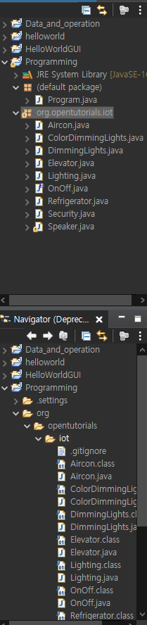
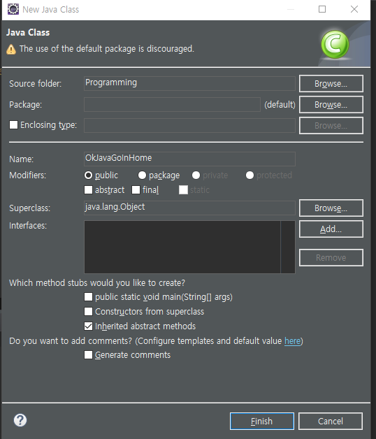

# -Java 4. 프로그래밍


- 프로그래밍을 만드는데 처음부터 끝까지 만들지는 않는다.
  - 다른 사람들이 만든 부품을 가지고 나의 프로그램을 만들어보자


## How 다른 사람의 부품을 사용할까?

1. 파일을 다운로드 받아서 사용한다.
   - 
     - `Package Explorer`를 보면 좀 특이하게 되어 있는 것을 발견할 수 있다.
2. Class 생성하기
   - 주의사항
     - 
       - 상단에 `Package`에 어떤 내용이 있다면 지워주는 것으로 `(default)` 가 나오도록 한다.


### 패키지 불러오기

- ```java
  import org.opentutorials.iot.Elevator;
  import org.opentutorials.iot.Lighting;
  import org.opentutorials.iot.Security;
  ```

  - import 를 해서 해당 경로에 맞게 찾아 가면 된다.


### 불러온 패키지 사용하기

- ```java
  public class OkJavaGoInHome {
  
  	public static void main(String[] args) {
  		// TODO Auto-generated method stub
  		
  		String id = "JAVA APT 1505";
  		
  		// Elevator call
  		Elevator myElevator = new Elevator(id);
  		// Elevator myElevator : Elevator 라는 데이터 타입, myElevator 라는 변수
  		// myElevator 라는 변수의 값으로는 반드시 Elevator 라는 데이터타입인 것들만 올 수 있다.
  		
  		myElevator.callForUp(1);
  		
  	}
  ```

  - `Elevator myElevator = new Elevator()`
    - myElevator : 변수
    - Elevator : 데이터 타입
    - myElevator 의 변수의 값으로는 반드시 Elevator 라는 데이터타입인 것들만 올 수 있다.


## 반복되는 값은??

- ```java
  public class OkJavaGoInHome {
  
  	public static void main(String[] args) {
  		// TODO Auto-generated method stub
  		
  		String id = "JAVA APT 1505";
  		
  		// Elevator call
  		Elevator myElevator = new Elevator(id);
  		// Elevator myElevator : Elevator 라는 데이터 타입, myElevator 라는 변수
  		// myElevator 라는 변수의 값으로는 반드시 Elevator 라는 데이터타입인 것들만 올 수 있다.
  		
  		myElevator.callForUp(1);
  		
  		// Security off
  		Security mySecurity = new Security(id);
  		mySecurity.off();
  		// on() : 메소드
  		
  		// Light on
  		Lighting hallLamp = new Lighting(id + " / Hall Lamp");
  		// ctrl + space 를 잘 사용하는 것이 좋다.
  		hallLamp.on();
  		
  		Lighting floorLamp = new Lighting(id + " / Floor Lamp");
  		floorLamp.on();
  	}
  ```

  - `String id = ` 이런 방식으로 반복되는 것을 줄여줄 수 있다.