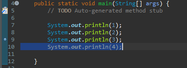

# Java 4. 디버거

## 해보기

1. 

   - Break Point : 좌측에 동그라미가 해당 줄에서 더블 클릭을 하면 나오는 것

## 사용하는 것들

debug : 버그를 한줄 한줄 찾아내고 체크가 가능
Step over : 한줄씩 코드 실행
Step into : 메소드의 형태를 볼 수 있다.
Step return : 다시 돌아옴
Resume : 디버거 실행
Terminate : 디버거가 끝남

## java로 나오기?!

1. 곤충 모양 = 디버거
2. 그 옆 = java

