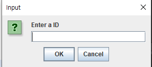
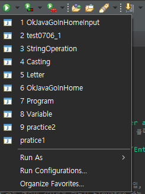
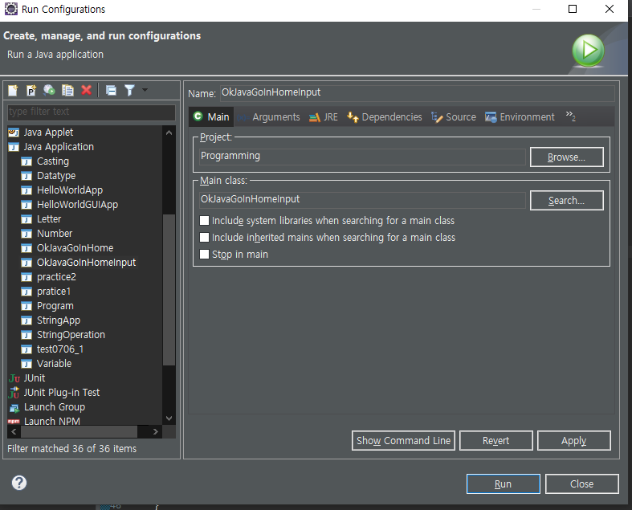
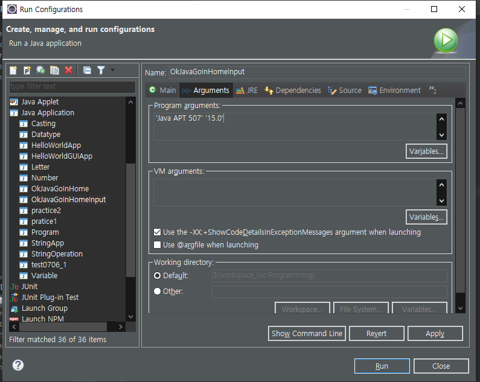
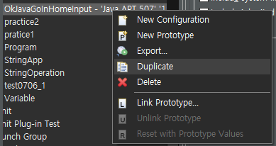
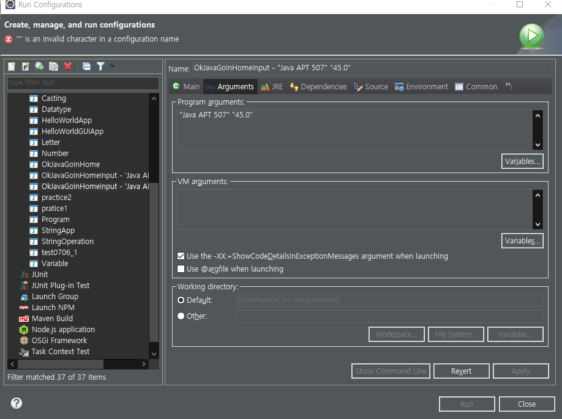
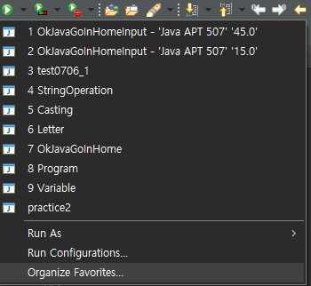
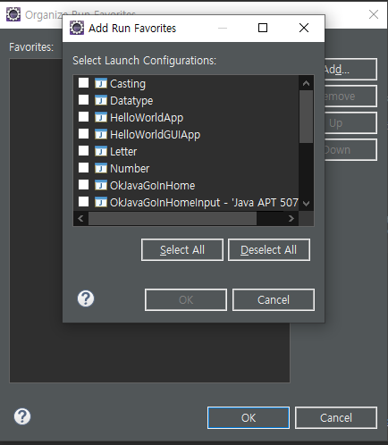

# Java 5. 입출력


Input -> Program -> Output


- Input
  - Argument
    - Text
  - File
  - Network
  - Audio
  - Program
- Output
  - Monitor
  - File
  - Audio
  - Program


- 우리가 주는 입력값을 어떻게 하느냐에 따라서 출력값이 달라진다.


## 검색하기

- ```text
  java popup input swing
  ```

  - 이렇게 검색해서 알아가는 것이다!


## popup input 만들기


1. ```java
   String id = JOptionPane.showInputDialog("Enter a ID");
   ```

   - `JOptionPane` 을 넣으면 빨간 줄이 뜰 것이다.
     왜냐하면 아직 읽어오지 못하기 때문이다.
     -> import 를 해줘야 한다! 이클립스에서는 마우스를 대면 뭘 해야하는지 나오기 때문에 걱정 없이 import 하자.

2. 

   - 입력한 값을 받아올 때까지 기다리는 것


## input 시 Data type 은 맞춰야 한다.

- 어떤 메소드가 double 을 원하고 있는데, String 을 넣어버리면 에러를 일으킨다.
  - 해결책
    1. 해당하는 값을 수동으로 변환할 수 있으면 변환시킨다.
    2. 메소드를 사용해서 변환한다.


### String to Double `Double.parseDouble(String)`

- 문자열을 받아서 double 형식으로 바꿔주는 것


#### 문제점

- 순수한 숫자로 변환되는 것이 아닌 알파벳으로 표현될 수도 있다.

- ```java
  
  public class test0706_1 {
  
  	public static void main(String[] args) {
  		// TODO Auto-generated method stub
  
  		String strNum1 = "12345678.123";
  		String strNum2 = "12345679.456";
  		
  		double dNum1 = Double.parseDouble(strNum1);
  		double dNum2 = Double.parseDouble(strNum2);
  		
  		System.out.println("String Type : " + strNum1 + "\t parseDouble : " + dNum1);
  		System.out.println("String Type : " + strNum2 + "\t parseDouble : " + dNum2);
  	}
  
  }
  
  // 결과
  String Type : 12345678.123	 parseDouble : 1.2345678123E7
  String Type : 12345679.456	 parseDouble : 1.2345679456E7
  ```


- 해결책

  - NumberFormat class 의 `setGroupingUsed(Boolean)` 메소드 를 사용해야 한다.

  - `setGroupingUsed(Boolean)` : 해당 숫자 포멧을 사용하는지 안하는지를 설정해주는 메소드

    - 매개 변수에 `false` 를 넣어주면 더이상 double 에 지수표현 (알파벳) 을 사용하지 않는다.

  - ```java
    NumberFormat format = NumberFormat.getInstance();
    		
    		format.setGroupingUsed(false);
    		
    		System.out.println("NumberFormat사용 1 : " + format.format(dNum1));
    		System.out.println("NumberFormat사용 2 : " + format.format(dNum2));
    
    //결과
    NumberFormat사용 1 : 12345678.123
    NumberFormat사용 2 : 12345679.456
    ```


## Tip : eclipse run setting

1. Run Configurations
   - 
2. Configrations 창
   - 
     - Main 탭에서 확인할 수 있는 것
       1. Project
       2. Main class
3. Argument
   - 
     - Argument 탭 -> Program arguments
       - input 으로 받을 것을 여기에서 받아올 수 있다.
       - 입력하는 방법
         1. `"내용"`
            - 큰 따옴표 안에 입력값을 넣는다.
            - 강의 에서는 `''` 작은 따옴표를 사용했는데, 내가 사용하는 환경에서는 `""` 큰따옴표를 사용해야 한다.
         2. `"내용" "내용"`
            - 띄어쓰기를 통해서 몇 개의 값이 들어가는지에 대해서 결정한다.


## Argument

- 인자

- ```java
  public static void main(String[] args)
  ```

  - `args `
    - 프로그램을 사용하는 사람과 프로그램 사이에 값을 매개해준다고 해서 **매개변수**, **parmeter**
    - 사용자가 입력한 값이 들어오는 곳
  - String[]
    - 문자열로 이루어진 배열이라는 데이터
  - `String [] args`
    - args라는 곳에 사용자가 입력한 데이터가 들어간다!


## Tip : run configurations duplicate

- run configurations 를 통해서 arguments 를 셋팅하다보면 다른 값을 넣어야할 필요도 있을 것이다.
- 
  - 해당 프로젝트 -> 우클릭 -> Duplicated


## 주의 : Run Configurations Name 설정 (큰 따옴표 X)

- 
  - Name 에 `""` 큰 따옴표가 들어가면 안된다.


## Tip : 자주 사용하는 파일 등록하기

- 
  - Organize Favorites
- 
  - Add -> 추가하기


