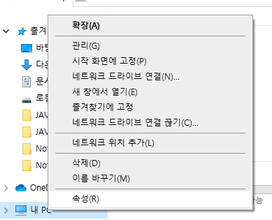
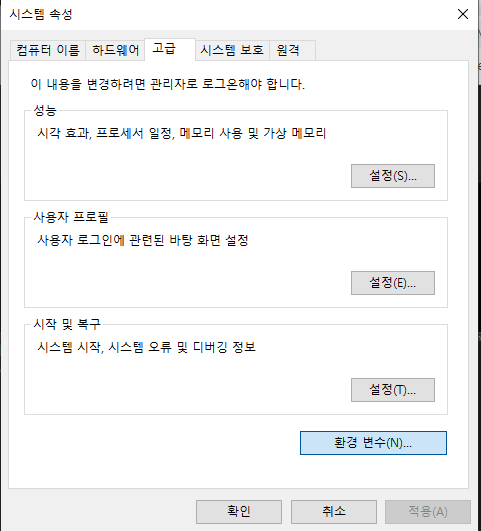
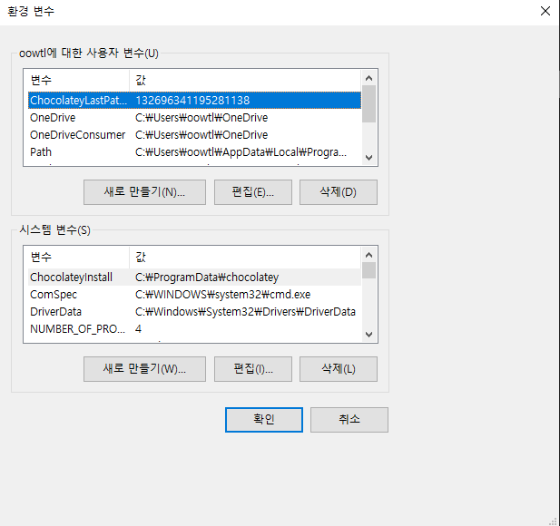

# Java 7. Eclipse


## 관전 포인트

- 이렇구나~~ 하기


## 3가지 포인트

### Compile

- 자바 확장자가 붙은  source 를 class 확장자가 붙는 실행파일로 바꾸는 것

### Run

- class 가 붙은 파일을 실행하는 것

### Input

- 입력값을 주는 것


## TIP : 환경변수 PATH


### window

1.  내컴퓨터 -> 내 pc -> 우클릭
   - 
2. 정보 -> 고급 시스템 설정
   - 
3. 환경 변수
   - 
4. 설정하기
   - 


### mac

1. `echo $PATH` 명령어를 통해서 환경변수를 확인한다.
2. `nano ~/.bash_profile`
   - `~` : 홈 디렉토리
   - nano : 편집 툴 같은 것


## 1. Complie

- 

  ```java
  javac Program.java
  ```

- ```bash
  javac -cp "." Program.java
  ```


- 결과
  - `.class` 파일이 생성된다.


### 패키지

- 작은 프로그램들이 모여있는 것!


### ClassPath

- ` --class-path <path>, -classpath <path>, -cp <path>`

  - 컴파일 하려고 하는 class 들이 어디에 있는지를 이야기해주는 것이다.

- ```window
   javac -cp ".;lib" OkJavaGoInHome.java
  ```

  - window 는 `;` 세미콜론으로 구분한다.

- ```mac
  javac -cp ".:lib" OkJavaGoInHome.java
  ```

  - mac 은 `:` 콜론으로 구분한다.


- 결과
  - `.class` 로 컴파일이 잘된다.


## 2. Run

- ```bash
  java Program
  ```

  - 확장자는 붙이지 않는다.


### lib 으로 빼둔 것 실행해보기

- ```bash
  java OkJavaGoInHome
  ```

  - ```bash
    Exception in thread "main" java.lang.NoClassDefFoundError: org/opentutorials/iot/Elevator
            at OkJavaGoInHome.main(OkJavaGoInHome.java:14)
    ```

    - 못찾겠다고 한다.
      org 폴더를 lib 폴더로 옮긴 상황이라서 org 폴더가 어디에 있는지 모르는 상황이다.

- 실행하기

  - ```bash
     java -cp "lib" OkJavaGoInHome
    ```

    - 이런 식으로 명시를 해줘야 한다.
    - 중요한 것은 `"lib"` 이라고만 하면 저 폴더에서만 찾게 된다.
      따라서 현재 디렉토리에서도 찾으라고 명시해줘야 한다.

  - ```bash
    java -cp ".;lib" OkJavaGoInHome
    ```

    - 현재 디렉토리까지 찾으라고 명시해주는 것


## 3. Input


### 어떻게 args 에 값을 넣어줄 수 있을까?

```bash
java OkJavaGoInHomeInput "Java APT 507" 15.0
```

- 이런 방식 args를 준다. `""` 으로 묶인 부분이 하나의 값으로  args 로 들어간다.
- 값의 구분은 띄어쓰기로 사용한다.


## 주의 :  명령 프롬프트에서 `[]` 는 이스케이프로 다룬다.

- 상황

  - `D:\SSAFY\ssafy-edu-2th-self\JAVA\Code\[JAVA_3]Complie` 위 경로로 이동해야 하는 상황
  - `Set-Location: Cannot find path 'D:\SSAFY\ssafy-edu-2th-self\JAVA\Code\[JAVA_3]Complie' because it does not exist.` 해당 에러가 계속 나오고 있다.

- 해결방법

  - ``` bash
    cd 'D:\SSAFY\ssafy-edu-2th-self\JAVA\Code\`[JAVA_3`]Complie'
    ```

    1. 경로 전체를 작은따옴표 `''`로 감싼다.
    2. `[]` 대괄호 앞에 이스케이프 문자 (`) 를 넣어주는 것으로 인식하게 한다.
