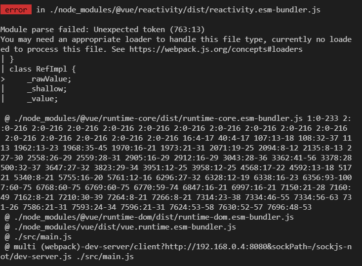

# Vue version issue


## 상황

- window 를 포맷하고 새롭게 설치하는 과정에서 이전에 되던 것들이 안되는 상황


### code

```bash
~/Desktop/test
$ vue create vue-devops

Vue CLI v4.5.13
? Please pick a preset: Manually select features
? Check the features needed for your project: Choose Vue version, Babel, Linter
? Choose a version of Vue.js that you want to start the project with 3.x
? Pick a linter / formatter config: Prettier
? Pick additional lint features: Lint on save   
? Pick a unit testing solution: Jest
? Where do you prefer placing config for Babel, ESLint, etc.? In dedicated conf
? Save this as a preset for future projects? No


Vue CLI v4.5.13
✨  Creating project in C:\Users\oowtl\Desktop\test\vue-devops.
🗃  Initializing git repository...
⚙️  Installing CLI plugins. This might take a while...

yarn install v1.22.10
info No lockfile found.
[1/4] Resolving packages...
[2/4] Fetching packages...
info fsevents@2.3.2: The platform "win32" is incompatible with this module.
info "fsevents@2.3.2" is an optional dependency and failed compatibility check.rom installation.
info fsevents@1.2.13: The platform "win32" is incompatible with this module.


success Saved lockfile.
Done in 28.00s.
🚀  Invoking generators...
📦  Installing additional dependencies...
[5/5] ⢀ deasync
yarn install v1.22.10
[1/4] Resolving packages...
[2/4] Fetching packages...
info fsevents@2.3.2: The platform "win32" is incompatible with this module.
info "fsevents@2.3.2" is an optional dependency and failed compatibility check.rom installation.
info fsevents@1.2.13: The platform "win32" is incompatible with this module.
info "fsevents@1.2.13" is an optional dependency and failed compatibility check
from installation.
[3/4] Linking dependencies...
[4/4] Building fresh packages...
success Saved lockfile.
Done in 13.23s.
⚓  Running completion hooks...

📄  Generating README.md...

🎉  Successfully created project vue-devops.
👉  Get started with the following commands:

 $ cd vue-devops
 $ yarn serve

```

- 설정

  ```bash
  Vue CLI v4.5.13
  ? Please pick a preset: Manually select features
  ? Check the features needed for your project: Choose Vue version, Babel, Linter
  ? Choose a version of Vue.js that you want to start the project with 3.x
  ? Pick a linter / formatter config: Prettier
  ? Pick additional lint features: Lint on save   
  ? Pick a unit testing solution: Jest
  ? Where do you prefer placing config for Babel, ESLint, etc.? In dedicated conf
  ? Save this as a preset for future projects? No
  ```

  1. `Manually select features`
  2. `Choose Vue version, Babel, Linter`
  3. `3.x`
  4. `Preetier`
  5. `Lint on save`
  6. `Jest`
  7. `dedicated conf`
  8. `N`


### Error

```bash
~/Desktop/test/vue-devops (master)
$ yarn serve
yarn run v1.22.10
$ vue-cli-service serve
 INFO  Starting development server...
98% after emitting CopyPlugin

 ERROR  Failed to compile with 1 error
 error  in ./node_modules/@vue/reactivity/dist/reactivity.esm-bundler.js

Module parse failed: Unexpected token (763:13)
You may need an appropriate loader to handle this file type, currently no loadeed to process this file. See https://webpack.js.org/concepts#loaders
| }
| class RefImpl {
>     _rawValue;
|     _shallow;
|     _value;

 @ ./node_modules/@vue/runtime-core/dist/runtime-core.esm-bundler.js 1:0-233 2::0-216 2:0-216 2:0-216 2:0-216 2:0-216 2:0-216 2:0-216 2:0-216 2:0-216 2:0-216  2:0-216 2:0-216 2:0-216 2:0-216 2:0-216 16:4-17 40:4-17 107:13-18 108:32-37 1113 1962:13-23 1968:35-45 1970:16-21 1973:21-31 2071:19-25 2094:8-12 2135:8-13 227-30 2558:26-29 2559:28-31 2905:16-29 2912:16-29 3043:28-36 3362:41-56 3378:28500:32-37 3647:27-32 3823:29-34 3951:12-25 3958:12-25 4568:17-22 4592:13-18 51721 5340:8-21 5755:16-20 5761:12-16 6296:27-32 6328:12-19 6338:16-23 6356:93-1007:60-75 6768:60-75 6769:60-75 6770:59-74 6847:16-21 6997:16-21 7150:21-28 7160:49 7162:8-21 7210:30-39 7264:8-21 7266:8-21 7314:23-38 7334:46-55 7334:56-63 731-26 7586:21-31 7593:24-34 7596:21-31 7624:53-58 7630:52-57 7696:48-53
 @ ./node_modules/@vue/runtime-dom/dist/runtime-dom.esm-bundler.js
 @ ./node_modules/vue/dist/vue.runtime.esm-bundler.js
 @ ./src/main.js
 @ multi (webpack)-dev-server/client?http://192.168.0.4:8080&sockPath=/sockjs-not/dev-server.js ./src/main.js
```




## 첫 번째 시도 (실패)


### 행동

1. `Module parse failed: Unexpected token(763:13)`
2. https://webpack.js.org/concepts#loaders
3. `@ ./node_modules/@vue/runtime-dom/dist/runtime-dom.esm-bundler.js``
4. ``@ multi (webpack)-dev-server/client?http://192.168.0.4:8080&sockPath=/sockjs-not/dev-server.js ./src/main.js`


- 구글링 결과
  - Babel, Webpack 등이 자주 나오는 것을 보아 이 부분이 문제일 것이라고 판단

### 결과

1. vue, vue cli 등 재설치
   - 재설치 하고 다시 해봤으나 동일한 결과 발생


## 두 번째 시도 (성공)

[기본 3.x 템플릿 # 6562에 대한 npm run serve 오류](https://github.com/vuejs/vue-cli/issues/6562)


### 목적

- 버전 문제를 해결하자.
  - 해당 문제가 버전 문제일 수도 있다는 것을 확인했다.
- 해결 방법
  1. 파일 작성
  2. vue 버전 다운그레이드 (vue 3.1.2 버전 or vue 2)
  3. vue/cli 5 베타버전 설치


### Error 이유

- Vue 3.1.3은 Vue CLI 4 로 빌드되지 않는다.


### 해결방법1. 파일 작성하기


1. 프로젝트 최상위 폴더에 `vue.config.js`파일을 생성한다.

2. 코드를 작성한다.

   - 코드내용

     ```js
     // vue.config.js
     module.exports = {
         transpileDependencies: ['@vue/reactivity']
     }
     ```

3. 실행한다.

   - ```bash
     yarn serve
     ```

   - ```bash
     $ yarn serve
     yarn run v1.22.10
     $ vue-cli-service serve
      INFO  Starting development server...
     98% after emitting CopyPlugin
     
      DONE  Compiled successfully in 4049ms                      오후 7:49:12
     
       App running at:
       - Local:   http://localhost:8080/
       - Network: http://192.168.0.4:8080/
     
       Note that the development build is not optimized.
       To create a production build, run yarn build.
     
     ```


### 해결방법2. vue 버전 다운 그레이드


- 요약
  - vue3 템플릿에 영향을 미치는 오류이다.
  - vue 2.x 로 롤백을 하는 것을 고려해야할수도 있다.
  - 기존에 설치되어져있는 vue를 삭제하고 다시 설치한다.
    그 과정에서 2.x , 3.1.2 버전을 택해서 설치한다.
  - **주의할점** : **vue cli 가 아닌 Vue 이다.**


1. Vue 삭제

   - ```bash
     npm uninstall vue
     yarn global remove vue
     ```

   - ```bash
     npm uninstall vue-cli -g
     yarn global remove vue-cli
     ```

     - Vue 와 vue cli 를 같이 삭제하고 재설치 했다.

2. Vue 설치

   - ```bash
     npm install vue@3.1.2
     ```

   - ```bash
     + vue@3.1.2
     added 11 packages from 2 contributors, removed 4 packages and audited 1602 packages in 14.071s
     
     86 packages are looking for funding
       run `npm fund` for details
     
     found 11 vulnerabilities (1 low, 7 moderate, 3 high)
       run `npm audit fix` to fix them, or `npm audit` for details
     ```

     - 결과가 이렇게 나온다면?

       - ```bash
         npm audit fix
         ```

       - 이 명령어를 해준다.

         npm install 패키지 설치 시에 취약점을 알려주는 것이다.
         `npm audit fix`를 통해서 취약점을 수정할 수 있다.

       - 결과

         - ```bash
           removed 4 packages in 8.028s
           
           86 packages are looking for funding
             run `npm fund` for details
           
           fixed 0 of 11 vulnerabilities in 1602 scanned packages
             11 vulnerabilities required manual review and could not be updated
           ```

3. Vue cli 설치

   - ```bash
     npm install -g @vue/cli
     ```

4. 실행

   - ```bash
     oowtl@DESKTOP-2FNVN08 MINGW64 ~/Desktop/test/test1 (master)
     $ yarn serve
     yarn run v1.22.10
     $ vue-cli-service serve
      INFO  Starting development server...
     98% after emitting CopyPlugin
     
      DONE  Compiled successfully in 3572ms                                                                          오후 10:19:54
     
       App running at:
       - Local:   http://localhost:8080/
       - Network: http://192.168.0.4:8080/
     
       Note that the development build is not optimized.
       To create a production build, run yarn build.
     ```


### 해결방법3. vue cli 5 베타버전 다운로드

- 베타버전을 다운 받는 것